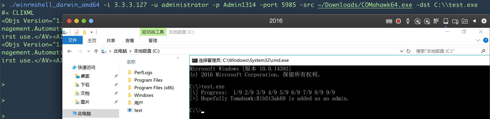

# WinRMShell

------

 一个 go 语言winrm shell客户端😄

-	支持 NTLM
-	交互式 or 半交互
-	删除了 cert 连接方式
-	根据 [winrmcp](github.com/packer-community/winrmcp/winrmcp) 添加了文件上传的功能, 支持上传文件或者文件夹

退出 CTRL+C 或者 exit 都可以, 师傅们自己尝试吧, 溜了溜了

TODO:

- 添加文件下载功能, 暂定9月初完成