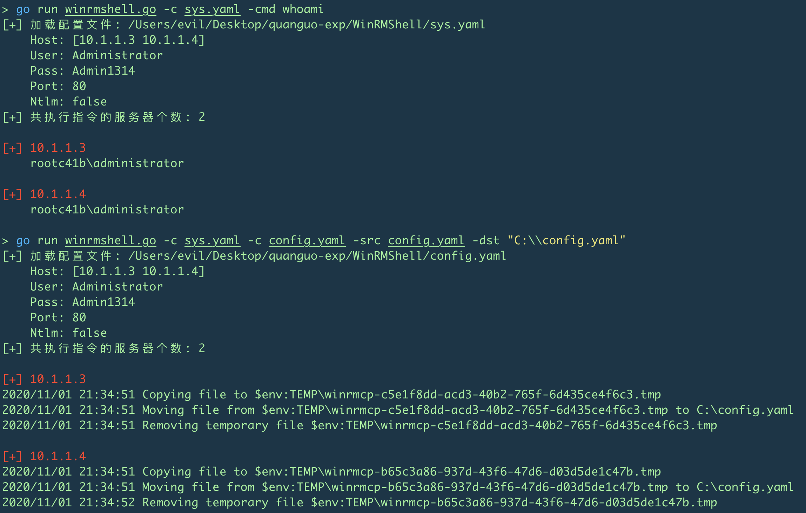
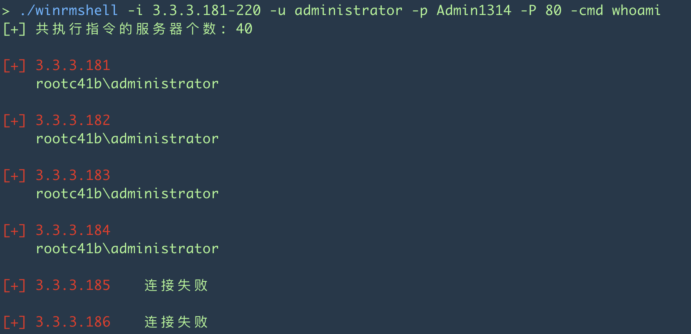

# WinRMShell

------

 一个 go 语言winrm shell客户端😄

-	支持 NTLM
-	交互式 or 半交互
-	删除了 cert 连接方式
-	根据 [winrmcp](github.com/packer-community/winrmcp/winrmcp) 添加了文件上传的功能, 支持上传文件或者文件夹
-	添加了批量执行功能

    - 支持ip段
    - 当批量执行, 自动退出交互式客户端
-	添加IP高亮
-	显示文件上传DEBUG信息, 建议 Timeout 根据环境修改

2020.11.1 添加读取配置文件方式, 可以参考sys.yaml, 当然也可以使用JSON, TOML, HCL

2020.10.31 添加批量

文件上传

执行命令

退出 CTRL+C 或者 exit 都可以, 师傅们自己尝试吧, 溜了溜了
